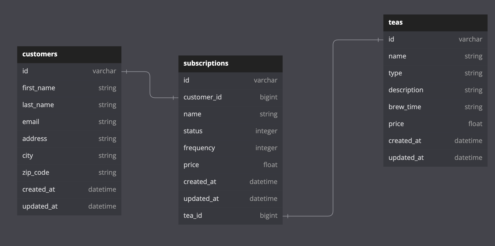

<div id="header" align="center">

</div>

# <p align="center"> :tea:Tea Subscriptions:tea: </p>

This application is an API that exposes endpoints for a customer to create a subscription to tea. The customer can also update the status of their tea subscription and view all of their subscriptions. 

## RESTful Endpoints

<details close>


### Get a Customer's Subscriptions

```http
GET /api/v1/customers/:customer_id/subscriptions
```

<details close>
<summary>  Details </summary>
<br>
    
Parameters: <br>
```
No Parameters
```

| Code | Description |
| :--- | :--- |
| 200 | `OK` |

Example Value:

```json
{
    "data": [
        {
            "id": "1",
            "type": "subscription",
            "attributes": {
                "name": "Detox tea",
                "price": 10.99,
                "status": "cancelled",
                "frequency": "biweekly",
                "customer_id": 1,
                "tea_id": 1
            }
        },
        {
            "id": "2",
            "type": "subscription",
            "attributes": {
                "name": "Weight lost",
                "price": 10.99,
                "status": "active",
                "frequency": "biweekly",
                "customer_id": 1,
                "tea_id": 2
            }
        },
        {
            "id": "3",
            "type": "subscription",
            "attributes": {
                "name": "Clear up",
                "price": 8.99,
                "status": "cancelled",
                "frequency": "monthly",
                "customer_id": 1,
                "tea_id": 3
            }
        }
    ]
}
```

</details>

---

### Create a Subscription

```http
POST /api/v1/customers/:customer_id/teas/:tea_id/subscriptions
```

<details close>
<summary>  Details </summary>
<br>
    
Parameters: <br>
```
CONTENT_TYPE=application/json
```

| Code | Description |
| :--- | :--- |
| 201 | CREATED |

Example Value:

```json
{
    "data": {
        "id": "1",
        "type": "subscription",
        "attributes": {
            "name": "Detox tea",
            "price": 10.99,
            "status": "active",
            "frequency": "biweekly",
            "customer_id": 1,
            "tea_id": 1
        }
    }
}
```
</details>

---

### Update a Subscription

```http
POST /api/v1/customers/:customer_id/teas/:tea_id/subscriptions/:subcription_id
```

<details close>
<summary>  Details </summary>
<br>
    
Parameters: <br>
```
CONTENT_TYPE=application/json
```

| Code | Description |
| :--- | :--- |
| 200 | OK |

Example Value:

```json
{
    "data": {
        "id": "1",
        "type": "subscription",
        "attributes": {
            "name": "Detox tea",
            "price": 10.99,
            "status": "cancelled",
            "frequency": "biweekly",
            "customer_id": 1,
            "tea_id": 1
        }
    }
}
```
</details>
</details>

## Status Codes

Tea Subscriptions returns the following status codes in its API:

| Status Code | Description |
| :--- | :--- |
| 200 | `OK` |
| 201 | `CREATED` |
| 400 | `BAD REQUEST` |
| 404 | `NOT FOUND` |
| 500 | `INTERNAL SERVER ERROR` |

## Prerequisites
Running this project requires:
- Rails 7.0.4.3
- Ruby 2.7.2
- Gems: jsonapi-serializer | factory_bot_rails | faker | shoulda-matchers

## Installation

1. Fork and clone this repository
2. `cd` into the root directiory
3. `bundle install`
4. `rails db:{drop,create,migrate}`
5. Run the test suite with `bundle exec rspec`
6. Start the local server by running `rails s`
7. Visit the app on `localhost:3000` in your web browser

## Database Schema
